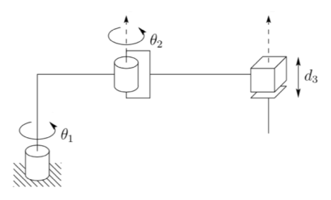
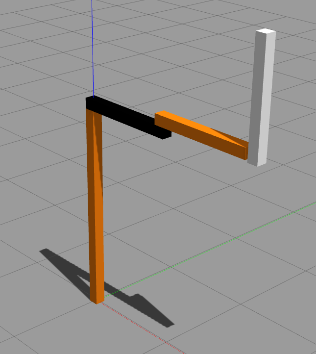
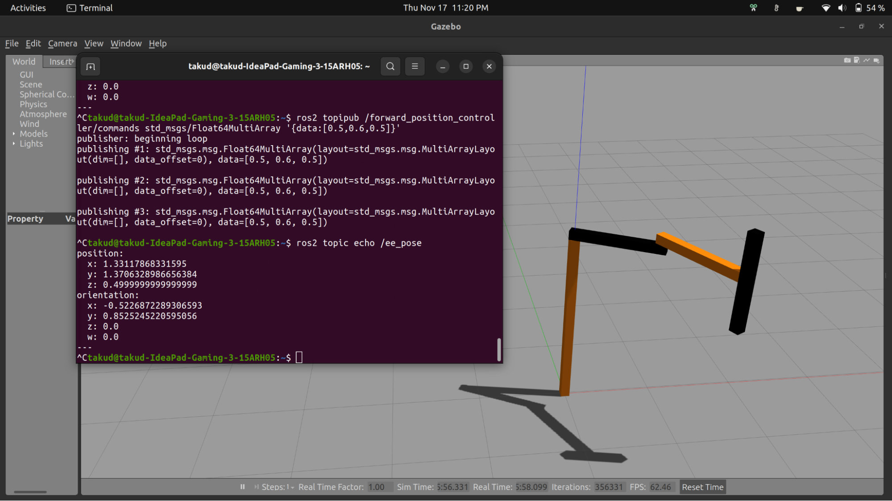
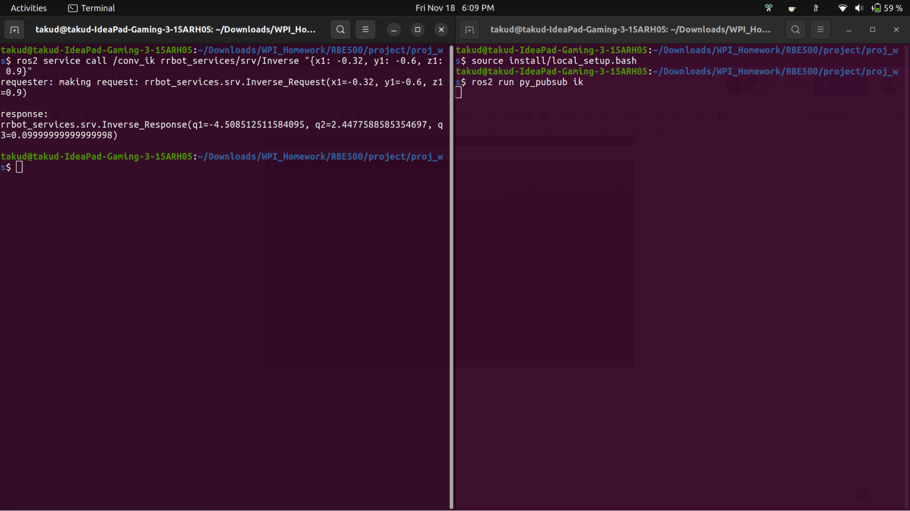

# PD Controller for 3-DOF arm

## Introduction

The dynamics model of the SCARA arm was used to implement a 3-DOF arm in the Gazebo simulator & it was controlled using a PD controller in ROS2 Humble.

 |
|:--:| 
| *Dynamics Model* |

## Robot Creation in Gazebo

In this section of the assignment, the objective was to create a robot based on the provided URDF file within the designated ROS package. The existing URDF file was modified to represent a robot with the appropriate motion axes, adhering to the configuration specified (a SCARA robot with two revolute joints and one prismatic joint).

 |
|:--:| 
| *The Designed Manipulator in Gazebo* |

## Forward Kinematics 

A ROS forward kinematics node for a Gazebo-simulated 3-degree-of-freedom (3DOF) manipulator was implemented. The node subscribes to joint values, calculates the end effector pose upon receiving new values, and publishes the result as a ROS topic. Three distinct robot poses were achieved by providing specific joint position references, each validated with accompanying screenshots. The accuracy of the end effector pose was confirmed using "ros2 topic echo," providing insights into the successful integration of ROS and Gazebo for controlling a 3DOF robotic manipulator in a simulated environment.

 |
|:--:| 
| *Forward Kinematics* |

## Inverse Kinematics

The node for inverse kinematics includes a service client that communicates with a service server, taking user-specified end effector poses and returning corresponding joint positions.

To verify the functionality, the node was tested using "ros2 service call" for three distinct end effector positions. Terminal response screenshots were captured, illustrating the successful execution of the inverse kinematics calculations. This succinct testing ensures the practical utility of the inverse kinematics node within the ROS framework for controlling the 3DOF manipulator.

 |
|:--:| 
| *Inverse Kinematics ROS Service* |